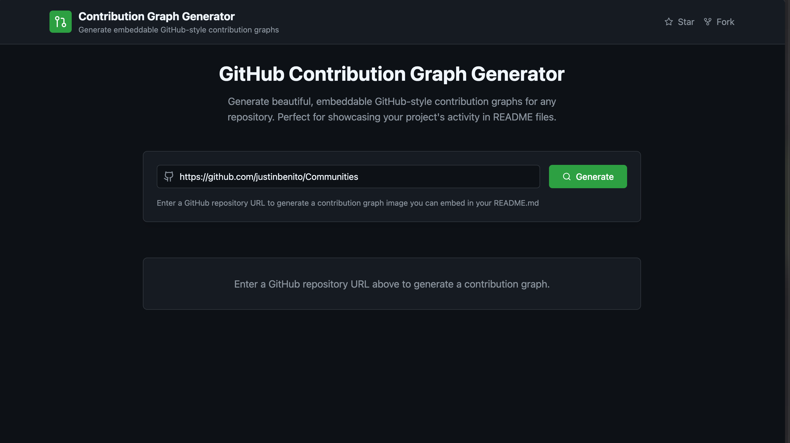

# GitHub Contribution Graph Generator

An application that generates embeddable GitHub-style contribution graphs for any repository. Perfect for showcasing your project's activity in README files or documentation.



## ✨ Features

- Generate GitHub-style contribution graphs for any public repository
- View detailed contribution statistics and metrics
- Real-time data fetching from GitHub's API
- 🖼️ Download contribution graphs as PNG images
- 🔗 Generate shareable links for your contribution graphs

## 🚀 Getting Started

### Prerequisites

- ReactJS
- A GitHub account (for API access)
- Supabase account (for image storage)

### Installation

1. Fork the repository and clone yours:

```bash
git clone https://github.com/your-name/github-repo-contributions-graph
cd github-contributions
```

2. Install dependencies:

```bash
npm install
# or
yarn install
```

3. Create a `.env` file in the root directory and add your environment variables:

```env
VITE_SUPABASE_URL=your_supabase_url
VITE_SUPABASE_ANON_KEY=your_supabase_anon_key
```

4. Start the development server:

```bash
npm run dev
# or
yarn dev
```

The application will be available at `http://localhost:5173`

## 🛠️ Built With

- [React](https://reactjs.org/) - Frontend framework
- [TypeScript](https://www.typescriptlang.org/) - Type safety
- [Tailwind CSS](https://tailwindcss.com/) - Styling
- [Vite](https://vitejs.dev/) - Build tool
- [Supabase](https://supabase.io/) - Image storage and caching
- [html-to-image](https://github.com/bubkoo/html-to-image) - Graph to image conversion

## 📝 Usage

1. Enter a GitHub repository URL in the format: `https://github.com/username/repository`
2. Click "Generate Graph"
3. View the contribution statistics and graph
4. Download the graph as a PNG image or copy the shareable link

## 🔧 Configuration

### Supabase Setup

1. Create a new Supabase project
2. Create a new table called `contribution_graphs` with the following schema:

```sql
create table contribution_graphs (
  id text primary key,
  owner text not null,
  repo text not null,
  repository_data jsonb,
  contribution_data jsonb,
  contributors_count integer,
  updated_at timestamp with time zone
);
```

3. Add your Supabase URL and anon key to the `.env` file

## 🤝 Contributing

Contributions are welcome! Please feel free to submit a Pull Request.

1. Fork the repository
2. Create your feature branch (`git checkout -b feature/AmazingFeature`)
3. Commit your changes (`git commit -m 'Add some AmazingFeature'`)
4. Push to the branch (`git push origin feature/AmazingFeature`)
5. Open a Pull Request

## 📄 License

This project is licensed under the GPL3 License - see the [LICENSE](LICENSE) file for details.
